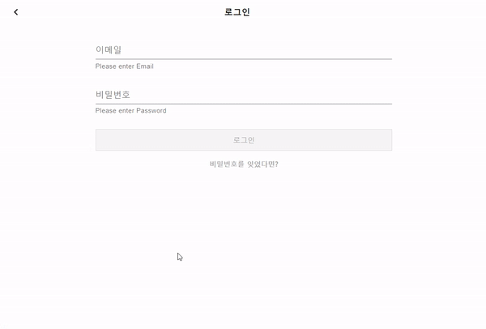

## 👩‍💻 I'm Soo and a software engineer

### 🙋‍♀️ _Profile_

<i>I am a software engineer with development experience building web applications with ReactJS and Recoil. I also have experience taking 720 hours of courses in Data Analysis with SQL and Python. Enjoying trying new things and in new fields, I've been involved in various experiences. Being attracted to creative developers' culture and processes, I hope to collaborate with various people as well.</i>

### 🚀 _Projects_

      
Todolist Web App Clone Project
 
      <i>December 2021 - Present</i>  
       
      <i>▪ Developed front-end user experience using React JS, Recoil, Material UI, and REST APIs 
      ▪ Built app with React and while managing State through Asynchronous Recoil Atom 
      ▪ Analyzed the target application's structure to clone </i>  
        
       

      
Fintech Product Design Challenge

      <i>June 2021 - August 2021</i>  
       
      <i>▪ Designed an idea, showing investment information and its correlation between social network service analysis and stock price 
      ▪ Conducted interviews and carried out paper research on 100 target users 
      ▪ Selected as a 15-team finalist and won $1,000 budget for the service idea </i>  
        
       

      
Data Analysis and Prediction of Portugal Student Performance

      <i>October 2021 - November 2021</i>  
       
      <i>▪ Analyzed the main variables that affect students' grades to identify better variable combinations 
      ▪ Used machine learning with Random Forest Model of scikit-learn in Python 
      ▪ Searched related research and papers to analyze given data set </i>  
       

### 💡 _Additional exprience_

##### Freecodecamp Proofreader of Korean Translation Volunteer Team

_July 2022 - Present_  
▪ Proofread translated articles on freecodecamp open source and communicated with the translator team remotely on Trello and Github 
 

### 🎓 _Education_

 
